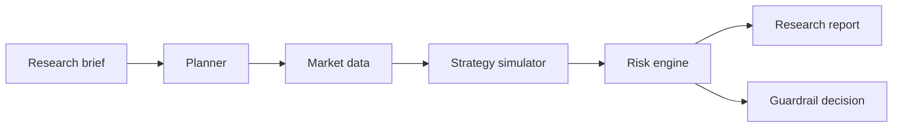

# Agentic Quant Lab

Research system for quantitative strategy exploration with explicit architecture boundaries between planning, simulation, risk and reporting.

> Research only. Not financial advice. No live trading execution.

## Problem

Most AI trading demos collapse planning, execution and risk into one opaque loop. That makes results hard to audit and unsafe to extend. This project separates those concerns so each stage can be inspected, tested and replaced independently.

## Architecture



### Components

| Layer | Responsibility |
| --- | --- |
| Planner | Turn a research brief into a deterministic experiment plan |
| Data loader | Provide reproducible market input, synthetic or real |
| Simulator | Run a transparent strategy baseline such as MA crossover |
| Risk engine | Enforce drawdown, volatility and activity constraints |
| Walk-forward | Evaluate strategy on contiguous out-of-sample folds |
| Cost model | Apply commission and slippage on position changes |
| Report | Emit structured JSON for review, CI or downstream tooling |

## Design Thinking

- **Determinism before complexity** — a simple simulator makes the pipeline testable.
- **Risk as a gate, not a footnote** — strategy output must pass explicit limits.
- **Research-only boundary** — no broker integration; paper-trading is the maximum scope.
- **Agent as planner, not trader** — the agent proposes experiments; the simulator and risk engine decide outcomes.

## Quick Start

```bash
python -m venv .venv
source .venv/bin/activate
pip install -e ".[dev]"
python -m agentic_quant_lab.cli --symbol DEMO --cash 10000
pytest
```

## Example Report

```json
{
  "symbol": "DEMO",
  "decision": "paper_trade_only",
  "total_return": 0.084,
  "max_drawdown": -0.031,
  "risk_notes": ["Strategy passed drawdown and volatility limits."]
}
```

## Evolution Path

- Regime labels on walk-forward folds
- FinRL-style train/test embargo windows
- LangGraph adapter for planner orchestration
- Experiment tracking and artifact export

See [docs/upstream-learning.md](docs/upstream-learning.md) for adopted patterns from vectorbt, backtesting.py and LangGraph.
